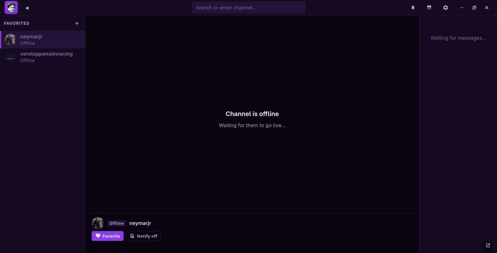
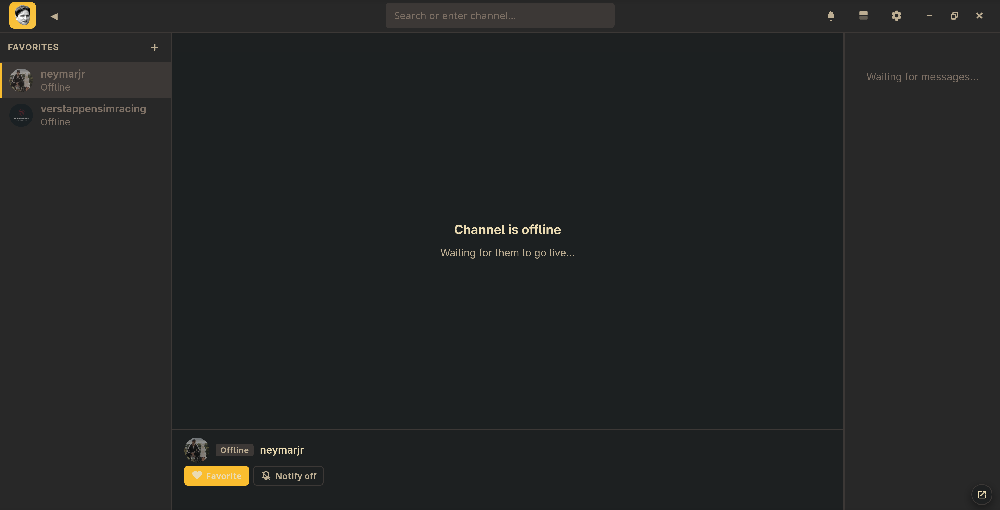
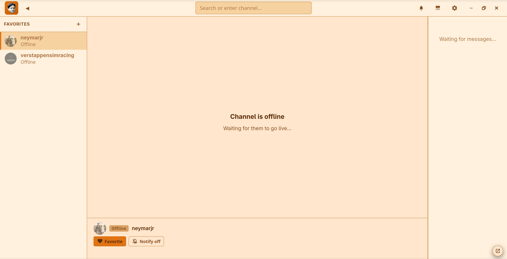

# kappastream

A native Linux Twitch client that works without an account.

No login, no ads, no tracking, no recommendations. Just the stream and the chat.

> **Status:** v0.1.3 — early, and rough in places. It works well for what I use it for, but you'll find bugs. Please [report them](../../issues).

---

## What it is

Some people want to chat, follow, subscribe, and be part of the community. Some people just want to put a stream on a second monitor and be left alone.

kappastream is for the second kind. If you've used FreeTube, it's a similar idea, for Twitch — live streams, real chat with 7TV/BTTV/FFZ emotes, favorites with live status, and picture-in-picture, without ever touching a Twitch account.

Chat connects anonymously through Twitch's own IRC gateway, which lets you read a channel without identifying yourself. There's no login flow because there's nothing to log into.

---

## Screenshots

<table>
  <tr>
    <td align="center"></td>
    <td align="center"></td>
    <td align="center"></td>
  </tr>
</table>

---

## Features

**Stream playback** — live HLS, quality selection, theater mode, fullscreen.

**Chat** — full IRC chat with Twitch, 7TV, BTTV and FFZ emotes, badges, colored names, timestamps and mention highlighting.

**Favorites** — sidebar with live status, viewer counts, current game and title. Drag to reorder. Export and import as JSON, stored locally.

**Notifications** — opt in per channel. Get notified when a channel goes live, or when you're mentioned in chat. Nothing else notifies you.

**Picture-in-Picture** — a floating, borderless window that snaps to 16:9 and remembers its position. (Needs a one-time compositor rule on Wayland — see [Known limitations](#known-limitations).)

**Themes** — 29 of them, plus a UI scale slider from 0.5× to 4×.

**Graceful degradation** — failed status checks keep showing the last known state and retry with backoff. A circuit breaker backs off when rate-limited rather than hammering the API.

---

## Privacy

There's no kappastream server and no kappastream account, so there's nothing to collect and nowhere to put it. Your favorites, settings and cached state live on your disk and go nowhere unless you export them yourself.

Rather than asking you to take that on faith, here's the complete list of every network request the app makes:

| Service | What it's for |
|---|---|
| **Twitch IRC** (`irc-ws.chat.twitch.tv`) | Reading chat, anonymously |
| **streamlink** (local binary) | Resolving the stream URL |
| **Twitch video CDN** (`ttvnw.net`, `twitch.tv`) | The video itself |
| **Twitch CDN** (`static-cdn.jtvnw.net`) | Chat badges and native emotes |
| **7TV / BTTV / FFZ** | Third-party emotes |
| **DecAPI** | Live status, viewer count, title, game |

That's the whole list. These services see what any web request shows them — an IP address and a request — and nothing about you, because the app doesn't know anything about you.

No Helix, no Kraken, no OAuth token in a config file. The app can't authenticate with Twitch even if you wanted it to.

**Verifying this yourself:** release binaries are built by GitHub Actions from a tagged commit — the [workflow](.github/workflows/release.yml) and the [build log](../../actions) are both public. Every release ships a `SHA256SUMS` file, so you can confirm the binary you downloaded is the one CI produced:

```bash
sha256sum -c SHA256SUMS
```

---

## Install

**Arch / AUR** — `yay -S kappastream-bin` (or `kappastream-git` to build from source)

**AppImage / Debian / Ubuntu / Fedora** — download from [Releases](../../releases). AppImage: `chmod +x`, then run.

### streamlink

kappastream resolves streams by calling out to [streamlink](https://streamlink.github.io/), which already solves this problem well. The `.deb` and `.rpm` packages pull it in automatically; **AppImage users need to install it themselves**, since AppImages can't declare dependencies:

```bash
sudo pacman -S streamlink     # Arch
sudo apt install streamlink   # Debian / Ubuntu
sudo dnf install streamlink   # Fedora
pip install streamlink        # anywhere
```

If it isn't on your `PATH`, point at it explicitly:

```bash
STREAMLINK_BIN=/opt/bin/streamlink ./kappastream.AppImage
```

If streamlink is missing, the app says so clearly rather than failing silently.

---

## Build from source

```bash
npm install
npm run check                       # svelte-check + tsc
npm run build                       # produces dist/
npx tauri build --bundles appimage  # first run: 15–30 min Rust compile
```

Output lands in `src-tauri/target/release/bundle/appimage/`.

There's no `npm run dev` — the frontend is compiled once and embedded into the binary. kappastream is a Tauri app, not a website.

---

## Stack

- **Svelte 5** (runes) + TypeScript — the UI
- **Vite** — builds `dist/`, embedded into the binary at compile time
- **hls.js** — stream playback
- **Raw IRC over WebSocket** — chat, with a hand-written parser
- **Tauri 2** (Rust) — native shell, subprocess handling, packaging

Around 30 MB rather than the ~300 MB you'd get bundling Chromium.

---

## Project layout

```
src/
  App.svelte              # Layout, IRC socket, HLS, persistence, stream resolution
  app.css                 # Theme tokens (CSS custom properties)
  lib/
    Sidebar.svelte        # Favorites, drag-reorder, import/export
    PlayerControls.svelte # PiP, theater, fullscreen, quality
    Settings.svelte       # Themes, UI scale, mentions, backup
    favorites.svelte.ts   # DecAPI polling + retry backoff + status cache
    irc.ts                # IRC parser
    emotes.ts             # Twitch + 7TV + BTTV + FFZ loaders
src-tauri/
  src/
    resolve.rs            # resolve_stream  — runs streamlink
    decapi.rs             # decapi_fetch    — status lookups
    opener.rs             # open_url_robust — external links (twitch.tv only)
    export.rs             # save_favorites_export — native Save As
packaging/                # AUR, Debian, Fedora
```

---

## Known limitations

**Picture-in-Picture needs a one-time compositor rule on Wayland.** WebKitGTK doesn't implement the HTML5 PiP API, so kappastream builds its own borderless floating window. Tauri requests always-on-top through GTK's keep-above hint, which works on X11 but is a no-op on Wayland — xdg-shell has no always-on-top concept.

<details>
<summary><b>Hyprland</b></summary>

Since Hyprland 0.55, window rules use Lua instead of the old `windowrulev2` config syntax. Add this to `~/.config/hypr/hyprland.lua`:

```lua
hl.window_rule({
  match = { title = "^(kappastream — PiP)$" },
  float = true,
  pin   = true,
})
```

(On Hyprland 0.54 or earlier, use the old syntax instead: `windowrulev2 = float, title:^(kappastream — PiP)$` and `windowrulev2 = pin, title:^(kappastream — PiP)$`.)
</details>

<details>
<summary><b>KDE / KWin</b></summary>

Focus the PiP window → `Alt+F3` (or right-click the title bar) → **More Actions** → **Configure Special Window Settings**. This opens the window rules dialog for that window specifically.

Add a new property called **Layer** and set its value to **Overlay**. Save.

The older "Keep Above" rule is X11-era and unreliable on Wayland for windows like this one — `Layer: Overlay` is the property that actually works.
</details>

**Live status depends on DecAPI.** It's a third-party service and a single point of failure — if it's down or rate-limiting, live status, viewer counts and titles stop updating. Playback and chat are unaffected.

**streamlink must be installed.** See above.

**Linux only.** X11 and Wayland. No macOS or Windows builds.

---

## Contributing

Bug reports and PRs are welcome — see [CONTRIBUTING.md](CONTRIBUTING.md). If you hit something broken, an [issue](../../issues) with your distro, compositor and the app version is genuinely useful.

---

## License

**GPL-3.0-only.** Copyleft on purpose: if someone forks this and adds ads or telemetry, they have to publish that too.

See [LICENSE](LICENSE) for the full text. Distributed in the hope that it will be useful, but **without any warranty**.

---

<sub>Not affiliated with, endorsed by, or connected to Twitch Interactive, Inc. "Twitch" and related marks are trademarks of their respective owners. This project does not authenticate with Twitch, does not use Twitch's Helix or Kraken APIs, and holds no Twitch credentials of any kind.</sub>
